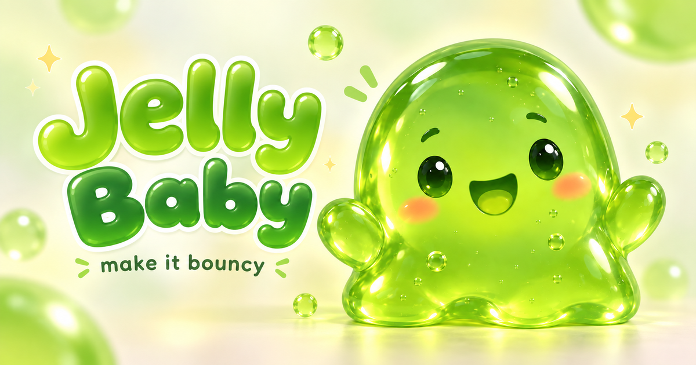

# Jelly Baby - The Ultimate Useless Soft Playground 🎀

## Basic Details
### Team Name: Jelly Squad

### Team Members
- Team Lead: Goutham Sankar - College of Engineering Alappuzha

### Project Description
Jelly Baby is a hyper-realistic, ultra-soft 7cm physics playground in your browser. You can poke it, drag it with your mouse (with custom squish sounds!), throw it on a trampoline, swing it, slide it, seesaw it, put it to bed, and watch it laugh, wobble and jiggle with real soft-body physics. It does absolutely nothing productive — and that's the point.

### The Problem (that doesn't exist)
Real babies are too hard, too loud, and don't bounce high enough on trampolines. Existing jellies on the internet are not scientifically wobbly enough. Humanity has suffered for too long without a 7cm WebGPU-rendered jelly that laughs when you swing it too fast.

### The Solution (that nobody asked for)
We built a full XPBD soft-body simulation with 3D WebGPU refractive jelly rendering just so you can drag a jelly with your mouse while it makes *squish* sounds, bonk it into wooden blocks (bonk.mp3!), and send it down a slide and seesaw. It has volume preservation, friction, restitution, and a dedicated laugh trigger at 15 degrees. Because why not?

## Technical Details
### Technologies/Components Used
For Software:
- **Languages:** TypeScript, JavaScript, GLSL/WGSL (shaders)
- **Frameworks:** Three.js (WebGPU Renderer), Vite
- **Libraries:** Delaunator (triangulation), Custom XPBD Soft-Body Physics Engine, Web Audio API
- **Tools:** Node.js, ESLint, TSC, Vite, Blender (for 3D models)

For Hardware:
- No hardware - Purely browser-based! Just a WebGPU-capable browser and a mouse to poke the jelly.

### Implementation
For Software:
# Installation
```bash
npm install
```

# Run
```bash
npm run dev      # start dev server
npm run build    # production build
npm run preview  # preview build
```

# Test
```bash
npm run typecheck
npm run lint
npm run test:physics
npm run test:swing
npm run test:trampoline
npm run test:slide
npm run test:seesaw
npm run test:facility-sound
```

### Project Documentation
For Software:

# Screenshots

*Jelly Baby chilling on the table - the main playground with swing, trampoline, bed and scattered toys*


*Our new addition: The Timber Slide in the north-west - climb the ladder, perch, and WHOOSH down with laughing physics*


*The new Seesaw on the east side - it auto-pumps, creaks, and makes the jelly giggle past 15 degrees*

# Diagrams

*Workflow: User Input (WASD/Mouse/Drag) -> Locomotion & Grab System -> XPBD Soft-Body Solver (240Hz) -> Facilities (Swing/Trampoline/Slide/Seesaw/Bed) -> Three.js WebGPU Renderer (Refraction + Shadows) + Web Audio (drag.mp3 / collide.mp3 / whoosh/creak)*

For Hardware:
- Not Applicable - This is a software-only useless project.

### Project Demo
# Video
[Add your demo video link here - e.g. https://youtu.be/YOUR_VIDEO_ID]
*Demo shows: Poking and dragging the jelly (custom drag.mp3 loops), bonking into blocks (collide.mp3), riding the Swing, bouncing on the Trampoline, climbing & sliding down the new Slide, and rocking the new Seesaw until it laughs.*

# Additional Demos
- Live Demo: `npm run dev` and open http://localhost:5173
- Try dragging with mouse, pressing `E` near each equipment, and `Space` to hop!

## What's New (We Added)
- **Custom Drag Sound:** `public/drag.mp3` (your Untitled.mp3) now loops while mouse-dragging the jelly
- **Custom Collision Sound:** `public/collide.mp3` (your Untitled2.mp3) now plays on every prop knock (blocks/spools/duck)
- **New Facility - Slide:** Ladder + platform + teal chute. Board at ladder (E) -> auto climb (1.15s) -> Push off (E) -> gravity slide -> launch. With slide-whoosh sound and laugh on fast runs.
- **New Facility - Seesaw:** Spring-balanced plank. Board (E) -> auto-pumping rock -> laugh at high angle -> Hop off (E). With creak + air sounds.

## Team Contributions
- Goutham Sankar: Soft-body physics integration, Slide & Seesaw facilities, Custom sound system (drag.mp3/collide.mp3), Graphics & 3D models, Facility collision & shadows, Documentation & Testing

---
Made with ❤️ at TinkerHub Useless Projects 


